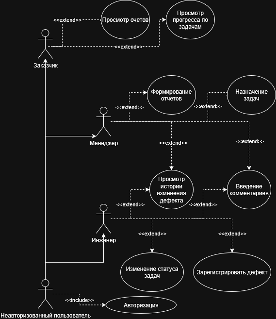
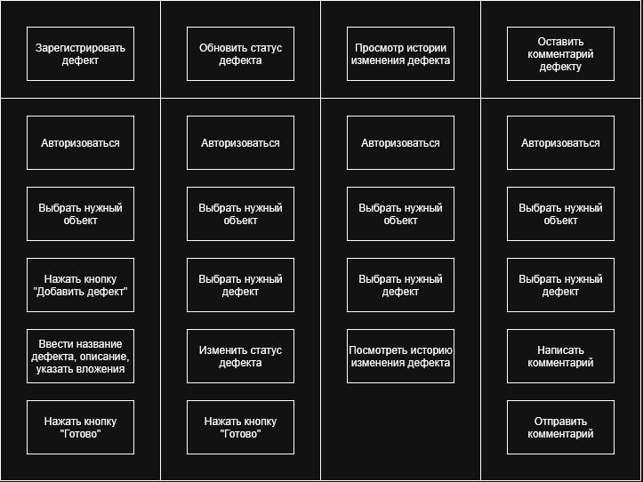

# Приложения для учета строительных дефектов

## Анализ

### Функциональные требования

1. Регистрация пользователей и аутентификация.
2. Разграничение прав доступа (менеджер, инженер, руководитель (заказчик) ).
3. Управление проектами/объектами и их этапами.
4. Создание и редактирование дефектов (заголовок, описание, приоритет, исполнитель, сроки, вложения).
5. Управление статусами дефектов: Новая → В работе → На проверке → Закрыта/Отменена.
6. Ведение комментариев и истории изменений.
7. Поиск, сортировка и фильтрация дефектов.
8. Экспорт отчётности в CSV/Excel.
9. Просмотр аналитических отчётов (графики, статистика).

### Нефункциональные требования

1. Время отклика страницы ≤ 1 секунды (для 50 активных пользователей).
2. Обеспечить резервное копирование БД раз в сутки.
3. Интерфейс на русском языке, адаптивный под ПК/планшеты.
4. Совместимость с Chrome/Firefox/Edge последних версий.
5. Пароли хранить с использованием bcrypt или argon2.
6. Защита от SQL-инъекций, XSS и CSRF.

### Роли и их возможности

1. Инженер
   - Регистрация дефектов
   - Обновление информации
2. Менеджер
   - Назначение задач
   - Контроль сроков
   - Формирование отчетов
3. Заказчик
   - Просмотр статуса задач и отчетности

### Use-case

### User-story

#### Инженер

